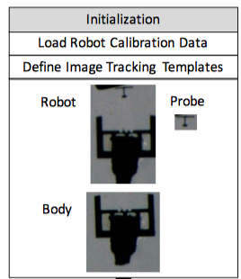
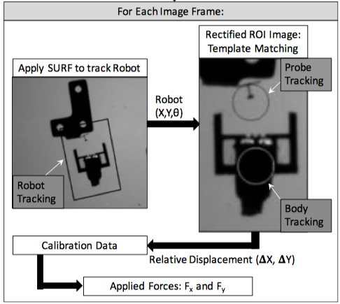
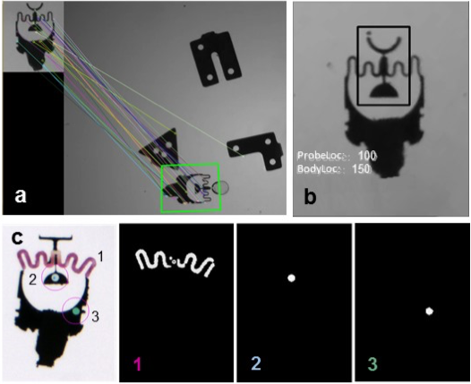

# Microbot Control + Force Sensing

## Features

This progam does path planning and give realtime force feedback of the microrobots developed by Purdue Multiscale Robotics Group.  The project is written in C++ with open source libraries like, OpenCV and CUDA. The project can be divided into control part and force sensing part. The control part is to power the magentic field generated by the four coil platform and read input from the controller, 3dconnexion. The force sensing part can read input from videos `videoprocessorVideo.h` or camera `videoprocessor.h` . For the tracking part, it has two approach : 1. color traking and feature tracking. The color tracking one is based on the new microobot that probe and body have different color. Feature tracking can work on basically any type of robot, and it works well when the probe is consipicuous.

## Files

**Control Part**

CoilDrive.cpp

CoilDriver.h

Control.cpp

Control.h

featuretracker.h

featuretrackerGPU.h

GUI.cpp

GUI.h

**Vision Sensing Part** 

KalmanFunction.cpp

main.cpp

MicroObject.cpp

MicroOBject.h

Serial.h

Serial.cpp

tracking.cpp

videoprocessor.h

videoprocessorVideo.h

## Installation Instruction

Visual Studio is recommended for this project. Go through the property sheet which has every external libraries you needed for the project. Double check the library, and make sure all the directories are correct. To start the project, go to `MSRAL_Micro_Force_Sensor.vcxproj` and this will trigger the Visual Studio in your computer.

**Packages required:**

OpenCV: Version 2.7?

CUDA: so far only the feature tracking approach used the CUDA library

FlyCap SDK: The project is developed based on FlyCap camera, and the the SDK is included in the property sheet.

The project should be run in **release** mode **not in debug** mode. The progamme can be switched to the debugg mode by installing OpenCV debugg library. Under both the `closeloop` and `color tracking` , you can find a folder called `image` which are the places where template images are stored.

`tracking.cpp` contians the directory for the video that you want to load.  

```cpp
// Open video file
processor.setInput("./video/PushToItsMaximum.avi"); // video: ./video/test.mp4
```

If you choose to read image from the camera frame. You do not need to worry about the directory of the video.

```cpp
// set frame processor
processor.setFrameProcessor(&tracker);
```

 This line loads the feature tracker that you decide to use. 

## Future Improvement

The current approach is not perfect. The color tracking method could be faster by using the CUDA library. Kalmain feature can be finely tuned to increase the stability of the path planing. A Kalman function is included in the project folder, but it is not perfect. Although it can improve the stability, it sensitive to the displacement of the probe. Due to the fruction from the petridish and magnetization of the robot, the robot is not easy to control. Reinforcement Learning could be useful for the system learn the parameters of the maganetic field which can lead to finer control of the movement of the robot.

For the control side, a haptic feedback controller can be added to allow a more interactive control.

## Ideas Behind the Algorithm

### Feature Based Approach

The main body of the feature trackng code in the `featuretrackerGPU.h` 

Prior to the tracking of the robot, the developed program is initialized by loading the calibration data specific to the $\mu$FSMM robot being used. In practice a non-linear polynomial fit to the experimental force-deflection data is used as the calibration data in the tracking algorithm.)
Next, a set of interactive features that allow the user to manually select the templates of the whole robot, the main body of the robot, and the end-effector tip or probe from the current camera frame. Examples of such templates are shown below



*Figure 1 Templates needed for color tracking* 

Once the templates are defined, the **SURF (Speeded-up Robust Feature) algorithm** is performed to first identify feature points on the robot template and in the associated live camera image and a 2D homography is used to track the position and orientation of the robot in camera frame. While other tracking algorithms may perform faster, they can only provide the location of the robot.  SURF was chosen since it can provide the full-state information (i.e., both position and orientation) for the robot. 
With this information, an affine transformation is applied to obtain a rectified region of interest (ROI) image of the robot. Next, the OpenCV template matching **Sum-of-Squared-Difference (SSD)** algorithm is used to locate the centroids of the end-effector tip (probe) and the body of the robot.  This template matching routine is resistant to the impact of the noise yet responsive enough to capture the small displacements of the end-effector tip.  It is also fast and simple to implement.

The deformation of the compliant structure is then calculated based on the difference between the coordinates of the center of the probe and the position of the robot body in the deformed image and that same distance in an image of the microrobot in its undeformed state. The locations of the probe center and the body center are determined in pixel units.  The conversion from displacement to force is calculated through the observed deformation and the stiffness values obtained from the calibration data. The figure below illustrates all the steps of the developed real-time tracking algorithm.



*Figure 2 Flow Charts of the feature tracking*  

The zoom-in ratio of the camera, the deformation range of the end-effector tip, geometry of the end-effector, and the lighting conditions can all affect accuracy of the tracking.  Therefore, the performance of the tracking algorithm was compared for one $\mu$FSMM against the off-line force measurements as ground truth, where a user manually selecting feature points in each image frame for displacement calculations.  The SURF-based tracking algorithm has an accuracy of approximately $\pm$ 2.95 pixels and $\pm$ 4.53 pixels in the X and Y direction, respectively.  

### Color Based Approach

While the SURF-based algorithm runs at real-time, it involves intensive computations (that require GPU processing) that limits the real-time speed of the vision-based force measurement that can be achieved. This feature detection method can also induce uncertainty due to the use of the 2D homography process. As previously mentioned, when the robot undergoes sudden rotational motion, its features are blurred due to the limited frame rate and the tracking breaks down. Therefore, we have developed a color-based tracking technique that is more stable and lightweight.



 Figure 3*(a) SURF detection of the microrobot; (b) Template matching tracking result and associated image locations of robot probe and body; (c) Color-tracking method: raw image frame and color matching results associated to the segmented (1) spring, (2) robot probe fiducial, and (3) body fiducial.*

The color-based tracking algorithm is first initialized by tuning the HSV values for the red, blue, and green colors that are to be detected on the robot (Fig.3(c)). After this, for each image frame, image dilation and erosion preprocessing algorithms are applied, the image is converted from RGB to HSV values, and color-thresholding is applied to determine the robot position and orientation in the workspace. The robot pose is determined using the color-tracked features. Principal component analysis (PCA) is used to determine the centroid of and orientation of the segmented spring structure in the image (Fig.3(c)(1)) and thus the robot pose. At startup, the robot is set up so it is not in contact with any other objects in the workspace and is in its undeformed state. The initial pose of the robot is determined by searching the entire image in the first five image frames. Once the program detects the robot’s pose in the first five frames, the search space is reduced in subsequent images frames from the original image to a just a region of interest (ROI) approximately two times of the size of the robot around the position of the robot in the previous frame. This is done since the robot will not displace an amount larger than the ROI in two consecutive frames. These first five image frames are also use to record the undeformed distances between the centroids of each of the color-tracked objects on the robot. To track the displacement of the spring, similar templates and the sum square difference (SSD) tracking can be used, as done in the case of the SURF-based tracking technique. In this case, the deformed and undeformed distance between the centroid of the spring (probe, (Fig.3(c)(1))) and the centroid of the body template are used to calculate the deformation.

## License

The project is licensed under the BSD license

If you are having issues, please let us know

We have a mailing list located at: wang1822@purdue.edu, an40@purdue.edu


